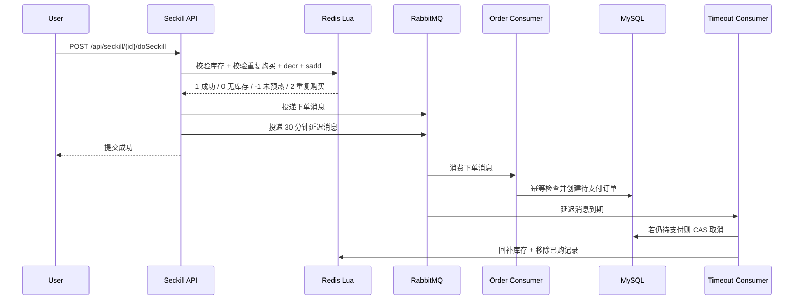

# Seckill 秒杀系统

一个基于 Spring Boot 的高并发秒杀系统练习项目，围绕“库存预热、Redis 原子扣减、RabbitMQ 异步下单、订单支付/取消、多级缓存抗压”搭建完整业务链路。项目包含后端服务、纯 HTML 前端页面、JMeter 压测脚本和缓存压测说明。

> 当前项目重点是秒杀核心链路和缓存抗压设计。压测目标为 500+ QPS，

## 技术栈
- Java 21, Spring Boot 4, Spring MVC, Validation, Actuator
- MySQL, MyBatis-Plus, 乐观锁版本号
- Redis, Lua Script, Redisson
- Caffeine 本地缓存, Redis 分布式缓存, Guava BloomFilter
- RabbitMQ, Publisher Confirm/Return, 死信队列, TTL 延迟队列
- JWT 登录态, Spring Security Crypto 密码加密
- JMeter 压测, 纯 HTML + 原生 JS 前端

## 核心能力
- 秒杀库存预热：活动开始前将库存写入 Redis，避免高并发请求直接打到 MySQL。
- Redis Lua 原子扣减：库存判断、重复购买判断、扣库存和记录已购用户在一个 Lua 脚本中完成。
- 异步削峰下单：扣减成功后投递 RabbitMQ，由消费者异步创建订单，降低接口同步耗时。
- 订单幂等与并发控制：下单前查询用户秒杀订单，订单支付/取消使用状态 + version 做 CAS 更新。
- 超时取消：RabbitMQ TTL 队列到期后进入死信队列，消费者取消未支付订单并回补 Redis 库存。
- MQ 失败兜底：生产者 Confirm Nack / Return 记录失败日志，并对下单消息执行库存回滚。
- 多级缓存：Caffeine + Redis + MySQL 查询重建，结合 BloomFilter、空值缓存、TTL 抖动和 Redisson 锁降低缓存穿透、击穿和雪崩风险。
- 缓存一致性：写入/创建活动后删除 Redis 和本地缓存，并通过 Redis Pub/Sub 广播本地缓存失效。
- 可观测入口：提供 `/api/cache/stats` 查看 Redis 命中、未命中、DB 查询、BloomFilter 拦截和 Caffeine 指标。

## 秒杀链路


Lua 扣库存返回码：

| 返回值 | 含义 |
|---:|---|
| `1` | 扣减成功 |
| `0` | 库存不足 |
| `-1` | Redis 库存未预热 |
| `2` | 用户重复购买 |

## 多级缓存设计

读商品和秒杀活动详情时，系统按以下顺序查询：

```text
BloomFilter 拦截非法 id
  -> Caffeine 本地缓存
  -> Redis 分布式缓存
  -> Redisson 重建锁
  -> MySQL
  -> 回写 Redis + Caffeine
```

缓存保护策略：

- BloomFilter：不存在的商品/活动 id 直接拦截，减少无效 DB 查询。
- 空值缓存：数据库查不到的数据写入短 TTL 空值，缓解缓存穿透。
- TTL 抖动：缓存过期时间增加随机抖动，降低同一时间大批 key 失效的风险。
- Redisson 重建锁：缓存失效时只有一个请求回源 DB，其它请求短暂重试 Redis。
- Redis Pub/Sub：缓存变更时广播失效消息，清理其它节点的 Caffeine 本地缓存。

## 订单链路

1. 用户抢购成功后，接口只完成 Redis 扣库存和 MQ 投递，立即返回“提交成功”。
2. `SeckillOrderConsumer` 消费下单消息，执行订单幂等检查并创建待支付订单。
3. 用户可调用支付接口，订单使用 `status + version` 做 CAS 更新，避免重复支付。
4. 若 30 分钟内未支付，延迟队列消息到期，`OrderTimeoutConsumer` 取消待支付订单并回补 Redis 库存。
5. 用户主动取消订单时，也会通过 CAS 修改状态并回补库存。
